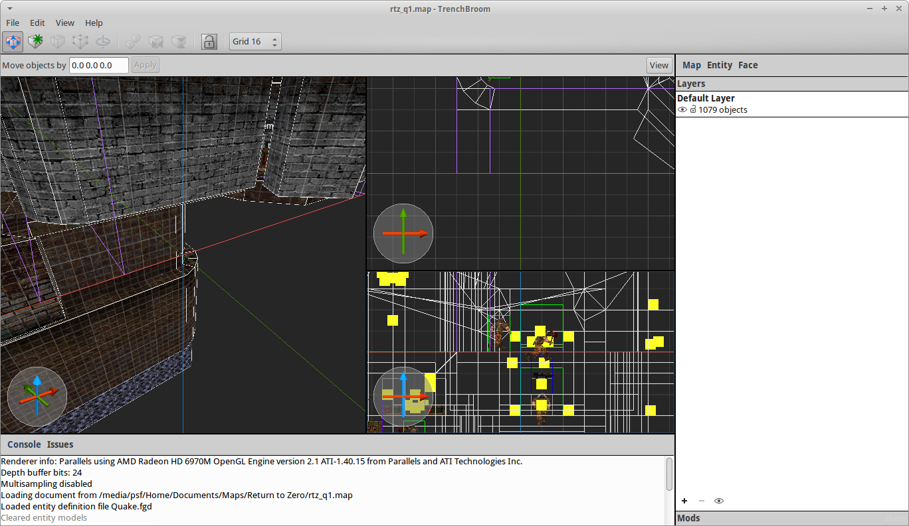
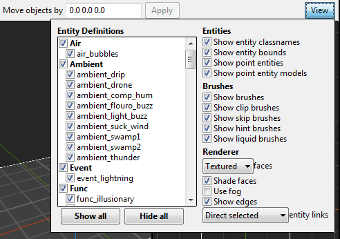

% TrenchBroom Documentation
% Kristian Duske
% 11-13-2015

# Introduction {#introduction}

TrenchBroom is a level editing program for brush-based game engines such as Quake, Quake 2, and Hexen 2. TrenchBroom is easy to use and provides many simple and advanced tools to create complex and interesting levels with ease. This document contains the documentation for TrenchBroom. Reading this document will teach you how to use TrenchBroom and how to use its advanced features.

## Features {#features}

* **General**
	- Full support for editing in 3D and in up to three 2D views
	- High performance renderer with support for huge maps
	- Unlimited Undo and Redo
	- Macro-like command repetition
	- Point file support
	- Automatic backups
	- Free and cross platform
	- Issue browser with automatic quick fixes
* **Brush Editing**
	- Robust vertex editing with edge and face splitting
	- Clipping tool with two and three points
	- CSG operations: merge, subtract, intersect, partition
	- UV view for easy texture manipulations
	- Precise texture lock for all brush editing operations
* **Entity Editing**
	- Entity browser with drag and drop support
	- Entity link visualization
	- Displays 3D models in the editor
	- Smart Entity Property Editors

## About This Document

This document is intended to help you learn to use the TrenchBroom editor. It is not intended to teach you how to map, and it isn't a tutorial either. If you are having technical problems with your maps, or need information on how to create particular effects or setups for the particular game you are mapping for, you should ask other mappers for help. This document will only teach you how to use this editor.

# Getting Started {#getting_started}

In this section, we introduce the welcome window, the game selection dialog, we give an overview of the main window and explain the camera navigation in the 3D and 2D views.

## Startup {#startup}

The first thing you will see when TrenchBroom starts is the welcome window. This window allows you to open one of your most recently edited maps, to create a new map or to browse your computer for an existing map you wish to open in TrenchBroom.

You can click the button labelled "New map..." to create a new map or you can click the button labelled "Browse..." to find a map file on your computer. Double click one of the documents in the list on the right of the window to open it. The light gray text on the left gives you some information about which version of TrenchBroom you are currently running. The version information is useful if you wish to report a problem with the editor (see [here](#reporting_bugs) for more information).

If you choose to create a new map, TrenchBroom needs to know which game the map should be for, and will show a dialog in which you can select a game and, if applicable, a map format. This dialog may also be shown when you open an existing map. TrenchBroom will try to detect this information from the map file, but if that fails, you need to select the game and map format.

The list of supported games is shown on the right side of the dialog. Below the game list, there is a dropdown menu for choosing a map format; this is only shown if the game supports more than one map format. One example for this is Quake, which supports both the standard format and the Valve 220 format for map files. In the screenshot above, none of the games in the list were actually found on the hard disk. This is because the respective game paths have not been configured yet. TrenchBroom allows you to create maps for missing games, but you will not be able to see the entity models in the editor and other resources such as textures might be missing as well. To open the game configuration preferences, you can click the button labelled "Open preferences...". Click [here](#game_configuration) to find out how to configure the supported games.

Once you have selected a game and a map format, TrenchBroom will open the main editing window. The following section gives an overview of this window and its main elements.

## Main Window {#main_window}

The main window consists of a menu bar, a toolbar, the editing area, an inspector on the right and an info panel at the bottom. In the screenshot below, there are three editing area: one 3D viewport and two orthographic 2D editing area.

The sizes of the editing area, the inspector and the info bar can be changed by dragging the dividers with the mouse. This applies to some of the dividers in the inspector as well. If a divider is 2 pixels thick, it can be dragged with the mouse. The following subsections introduce the most important parts of the main window: the editing area, the inspector, and the info bar. The toolbar and the menu will be explained in more detail in later sections.

### The Editing Area

The editing area is divided in two sections: The context sensitive info bar at the top and the viewports below. The info bar contains different controls depending on which tool is currently activated. You can switch between tools such as the rotate tool and the vertex tool using the toolbar buttons, the menu or with the respective keyboard shortcuts. The context sensitive controls allow you to perform certain actions that are relevant to the current tool such as setting the rotation center when in the rotate tool or moving objects by a given delta when in the default move tool. Additonally, there is a button labeled "View" on the right of the info bar. Clicking on this button unfolds a dropdown containing controls to [filter out](#filtering) certain objects in the viewports or to change how the viewport [renders its contents](#rendering_options).

There are two types of viewports: 3D viewports and 2D viewports. TrenchBroom gives you some control over the layout of the viewports: You can have one, two, three, or four viewports. See section [View Layout and Rendering](#view_layout_and_rendering) to find out how to change the layout of the viewports. If you have fewer than four viewports, then one of the viewports can be cycled by hitting #action('Controls/Map view/Cycle map view'). Which of the viewports can be cycled and the order of cycling the viewports is given in the following table:

No. of Viewports    Cycling View         Cycling Order
----------------    ------------         -------------
1                   Single view          3D > XY > XZ > YZ
2                   Right view           XY > XZ > YZ
3                   Bottom right view    XZ > YZ
4                   None

At most one of the viewports can have focus, that is, only one of them can receive mouse and keyboard events. Focus is indicated by a highlight rectangle at the border of the viewport. If no viewport is focused, you have to click on one of them to give it focus. Once a viewport has focus, the focus follows the mouse pointer, that is, to move focus from one viewport to another, simply move the mouse to the other viewport. The focused viewport can also be maximized by choosing #menu('Menu/View/Maximize Current View') from the menu. Hit the same keyboard shortcut again to restore the previous view layout.

### The Inspector

You can show or hide the inspector by choosing #menu('Menu/View/Toggle Inspector'). You can also switch directly to an inspector page: Choose #menu('Menu/View/Switch to Map Inspector') for the map inspector, #menu('Menu/View/Switch to Entity Inspector') for the entity inspector, and #menu('Menu/View/Switch to Face Inspector') for the face inspector.

### The Info Bar

You can show or hide the info bar by choosing #menu('Menu/View/Toggle Info Panel').

## Camera Navigation {#camera_navigation}

# Selection {#selection}

# Editing

## Creating Objects

### Creating Simple Brushes

### Creating Complex Brushes

### Creating Entities

### Duplicating Objects

## Editing Objects

## Deleting Objects

## Transforming Objects

## Working with Textures

## Shaping brushes

### Clipping Tool

### Vertex Editing

### CSG Operations

## Entity Properties

## Keeping an Overview

### Hiding and Isolating Objects

### Filtering {#filtering}

### Rendering Options {#rendering_options}

## Undo and Redo

# Preferences

## Game Configuration {#game_configuration}

## View Layout and Rendering {#view_layout_and_rendering}

## Mouse Input

## Keyboard Shortcuts

# Advanced Topics

## Command Repetition

## Issue Browser

## Solving Problems

## Display Models for Entities

## Customization

# Getting Involved

## Reporting Bugs {#reporting_bugs}

### The Version Information

Open the "About TrenchBroom" dialog from the menu. The light gray text on the left gives you some information about which version of TrenchBroom you are currently running, for example "Version 2.0.0 f335082 D". The first three numbers represent the version (2.0.0), the following seven letter string is the build id (f335082), and the final letter indicates the build type ("D" for Debug and "R" for release). You can also find this information in the Welcome window that the editor shows at startup.
